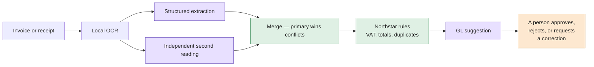

# Invoice Review

A Dutch fuel receipt kept coming back with a subtotal of 95.00. The page said 50.00.

The obvious explanation was the model — a 1B-parameter model reading a phone photo of a
receipt in a language it barely saw during training. I nearly swapped it. Then I printed the
text the model was actually receiving:

```
NORTH SEA FUEL B.V. KASSABON Datum: 19-07-2026 Pomp: 04 EURO 95 25.00 L x EUR 2.420
Brandstof EUR 60.50 Subtotaal excl. BTW EUR 50.00 BTW 21% EUR 10.50 ...
```

One flat line. Tesseract hands you `block_num`, `par_num` and `line_num` in its TSV output,
and I was discarding all three. On a financial document the *line* is what binds a label to
its amount. Flattened, `EURO 95` — the fuel grade — sits directly beside the money column and
gets read as the subtotal. `25.00 L`, a litre count, becomes the VAT.

One `groupby` fixed a document that had failed every check. No model change. That is most of
what this repository is about.

---

## What it is

An invoice and receipt review pipeline: upload a PDF or a photo, get back extracted fields,
deterministic policy findings, a suggested GL account, and a human decision. Multilingual —
English, Dutch, German, French.

Every model call goes through Ollama. Document extraction is local OCR. There is no managed
cloud extraction service anywhere in it.

## The boundary I care about

The model never decides anything. It reads evidence; ordinary Python decides what blocks
approval.



Purple calls a model. Green is pure and deterministic. A supplier VAT number is validated by
`python-stdnum`, not by asking an LLM whether it looks right. A total mismatch is arithmetic.
Model output is evidence, never policy.

## The independent review reads the document twice, by different routes

The second opinion originally re-read the exact text the primary extraction had already
read. Two paths, one string — they could only ever agree, and a shared misreading would be
confirmed rather than caught.

A PDF has two genuinely different routes to its content. The primary extraction reads the
embedded text layer; the review rasterizes the page and OCRs it. I checked the second route
costs nothing before relying on it: **528 non-space characters recovered by both**, with
every vendor, VAT ID, invoice number and total present in each.

An image has only one route. There the review says so, instead of borrowing the language of
an independence it does not have.

## Measured, not asserted

Two verification layers, because they catch different things.

```bash
# Deterministic behaviour: no model, no network, about a second
uv run --locked --no-sync python scripts/check_deterministic.py

# Corpus accuracy, with gating and regression detection
uv run --locked --no-sync python scripts/evaluate_corpus.py --merged \
  --baseline baselines/gemma4-cloud.json --min-accuracy 99
```

**44 deterministic checks** lock the pure functions — VAT repair, OCR line reconstruction,
confidence scoring, the Northstar rules. **The corpus evaluator can fail a build**:
`--min-accuracy`, stored baselines, variance across repeated runs.

Accuracy on the 13-document corpus:

| Model | Field accuracy | Exact documents | Policy matches |
| --- | ---: | ---: | ---: |
| `gemma4:cloud` (default) | 100% | 13/13 | 13/13 |
| `gemma3:1b` (fully offline) | 93.5% | 3/13 | 4/13 |

The local model is not a smaller version of the cloud one. It classifies a receipt as an
invoice, which applies the wrong rulebook and raises six errors on a document that should
pass. Offline is supported and documented with its cost, not presented as equivalent.

**The two layers are not redundant.** I reintroduced the OCR flattening bug to check: the
corpus stayed at 169/169 on `gemma4:cloud`, because a capable model reads flattened text
fine. The deterministic checks failed six behaviours instantly. End-to-end scores are blind
to structural defects a strong model compensates for.

## Confidence means "how well was the page read"

Not "how sure is the model" — nothing here asks a model to rate itself. A value found in the
recovered text keeps the OCR confidence; one that is not there is reduced.

Two required normalizations were being punished by that rule. The prompt *demands* ISO
dates, so a receipt printing `19-07-2026` yields `2026-07-19`, which is not on the page. The
VAT repair *deliberately* corrects OCR damage, so `NLO0449544B01` becomes `NL00449544B01`.
Both scored as inferences, both fell under the 0.80 threshold, both raised warnings a
reviewer could do nothing about. The pipeline was penalising itself for doing its job.

`repair_vat_id` also stopped mangling identifiers it cannot fix — `DE-NOT-A-VAT` was becoming
`DEN0TAVAT`. An invalid VAT number is evidence a reviewer may have to quote back to a
supplier.

## Run it

Needs Python 3.12+, Node 22+, [Ollama](https://ollama.com) signed in, poppler and tesseract.

```bash
brew install poppler tesseract tesseract-lang
ollama signin

cd backend && uv sync --locked && cp .env.example .env
cd ../frontend && pnpm install --frozen-lockfile && cp .env.example .env
cd .. && ./scripts/dev.sh
```

API on `:8000`, interface on `:5173`. `GET /ready` reports whether OCR and the model server
can actually serve a review — unlike `/health`, which only says the process is alive. Or
`docker compose up --build` to run one container against your host Ollama.

## Stack

Python 3.12 · FastAPI · Pydantic v2 · SQLAlchemy 2 · SQLite · Ollama · poppler + tesseract ·
`python-stdnum` · React 19 · TypeScript · Vite · Tailwind · Docker

No Python dependency was added to replace the managed extraction service. The OCR binaries
are invoked as subprocesses.

## What it does not do

- Offline with `gemma3:1b` scores 93.5% and misclassifies receipts. Documented, not hidden.
- No CI. The gates exist; nothing runs them automatically. A runner has no Ollama, so lint
  and the 44 model-free checks are the parts that would work there.
- `evaluate_corpus.py` understates accuracy without `--merged`, because it scores primary
  extraction rather than what the application actually shows.
- Confidence is not calibrated. The 0.80 threshold is a policy choice, not a measured
  separation between correct and incorrect answers.

## Documentation

[Architecture](docs/architecture.md) · [API and pipeline](docs/api-and-pipeline.md) ·
[Build log](docs/build-along.md) · [Deployment](docs/local-deploy.md) ·
[Client brief](docs/client-brief.md)

## Credits

Built on the Invoice Review starter by **Dave Ebbelaar**
([Datalumina](https://learn.datalumina.com/docs/invoice-review)), which supplied the client
brief and the 13-document fictional corpus with its manifest of expected values. The
extraction pipeline, the provider layer, the evaluation infrastructure, the confidence model
and the reliability work are mine — [docs/build-along.md](docs/build-along.md) records each
change and the reason for it.
