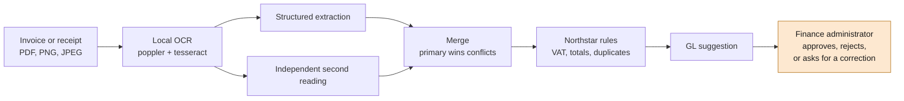

# Invoice Review

An end-to-end invoice and receipt review application for Northstar Facilities B.V. It
combines local OCR extraction, deterministic finance rules, SQLite persistence, and a human
review interface.

Document extraction runs entirely on your own machine with poppler and tesseract. The model
calls go to Ollama, which by default uses a cloud-served model for accuracy — that needs a
signed-in Ollama account with a subscription. Set `OLLAMA_MODEL` to a local model to run
fully offline at lower accuracy; see [Accuracy](#accuracy).

## How it works



A person makes the decision. The rules that block approval are ordinary Python and no model
output becomes policy.

## The stack

| Concern | Component |
| --- | --- |
| Document extraction | poppler (`pdftotext`, `pdftoppm`) and `tesseract` |
| Classification, independent review, GL suggestion, correction email | a model served by [Ollama](https://ollama.com), cloud-served by default |
| VAT validation | offline EU structure and checksum checks via `python-stdnum` |
| API | FastAPI, Pydantic v2, SQLAlchemy 2, SQLite |
| Interface | Vite, React, TypeScript, Tailwind CSS |

## Prerequisites

- Python 3.12 or newer, and [uv](https://docs.astral.sh/uv/)
- Node.js 22 or newer, and pnpm 11
- [Ollama](https://ollama.com), running locally and signed in (the default model is cloud-served and needs a subscription)
- poppler and tesseract with the English, Dutch, German, and French language data

```bash
# macOS
brew install poppler tesseract tesseract-lang

# Debian/Ubuntu
sudo apt-get install -y poppler-utils tesseract-ocr \
  tesseract-ocr-eng tesseract-ocr-nld tesseract-ocr-deu tesseract-ocr-fra
```

## Install

```bash
# The default model is cloud-served; sign in rather than pulling weights.
ollama signin

cd backend
uv sync --locked

cd ../frontend
pnpm install --frozen-lockfile
```

Copy the environment templates. Neither file contains a secret — the backend file points at
your local Ollama server, and the frontend file sets `VITE_API_BASE_URL`.

```bash
cp backend/.env.example backend/.env
cp frontend/.env.example frontend/.env
```

## Run

```bash
./scripts/dev.sh
```

- API: <http://localhost:8000> (`GET /health` returns `{"status":"ok"}`)
- Interface: <http://localhost:5173>

Or run the app in a container. It uses the Ollama on your host, because cloud credentials
belong to the signed-in host instance:

```bash
docker compose up --build
```

See [docs/local-deploy.md](docs/local-deploy.md) for model selection and memory requirements.

## Verify

```bash
cd backend
uv run --locked --no-sync ruff check app scripts

# Deterministic behaviour: no model or network needed, about a second
uv run --locked --no-sync python scripts/check_deterministic.py

# Corpus accuracy, with optional gating and regression detection
uv run --locked --no-sync python scripts/evaluate_corpus.py --merged
uv run --locked --no-sync python scripts/evaluate_corpus.py --min-accuracy 90
uv run --locked --no-sync python scripts/evaluate_corpus.py --baseline baselines/gemma4-cloud.json

cd ../frontend
pnpm exec tsc -b --pretty false
pnpm lint
pnpm build
```

OCR and the deterministic checks are local and free. The corpus evaluator makes model calls,
so with the default cloud model it consumes your Ollama subscription allowance.

## Accuracy

Accuracy depends heavily on the model. Measured on the 13-document corpus:

| Model | Field accuracy | Exact documents | Policy matches |
| --- | ---: | ---: | ---: |
| `gemma4:cloud` (default) | 100% | 13/13 | 13/13 |
| `gemma3:1b` (fully offline) | 93.5% | 3/13 | 4/13 |

The cloud model is the default because the small local models that fit in ordinary memory
are not good enough for this work: `gemma3:1b` misclassifies a receipt as an invoice, which
applies the wrong rulebook, and it misreads two-column supplier/customer layouts.

Running fully offline is still supported — set `OLLAMA_MODEL=gemma3:1b` — but measure it
rather than assuming, with `scripts/evaluate_corpus.py`.

Confidence shown in the interface is derived, not model-reported: a value found in the
recovered text keeps the OCR confidence, and a value the model inferred is reduced.
Required normalization, such as ISO dates and repaired VAT identifiers, is not treated as
inference.

The independent review reads the document by a different route than the primary
extraction: a PDF is rasterized and OCRed while the primary extraction reads the embedded
text layer, so agreement between them carries real information. An image has only one
route, and the review says so when it shares a source.

## Documentation

Start with [the client brief](docs/client-brief.md), then
[the architecture](docs/architecture.md) and [the API and pipeline](docs/api-and-pipeline.md).

## Credits

This project began from the Invoice Review starter by **Dave Ebbelaar**
([Datalumina](https://learn.datalumina.com/docs/invoice-review)). The client brief, the
13-document fictional corpus under `samples/`, the manifest of expected values, and the
original project configuration are his work.

It has since diverged substantially: the Azure Document Intelligence and Azure OpenAI
services the tutorial used were replaced with local OCR and Ollama-served models, and the
verification, confidence model, and independent-review design were rebuilt.
[docs/build-along.md](docs/build-along.md) records what changed and why.
