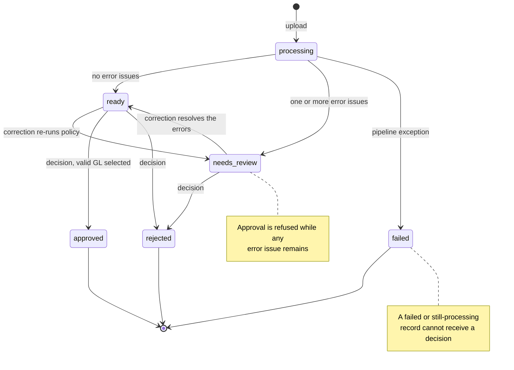
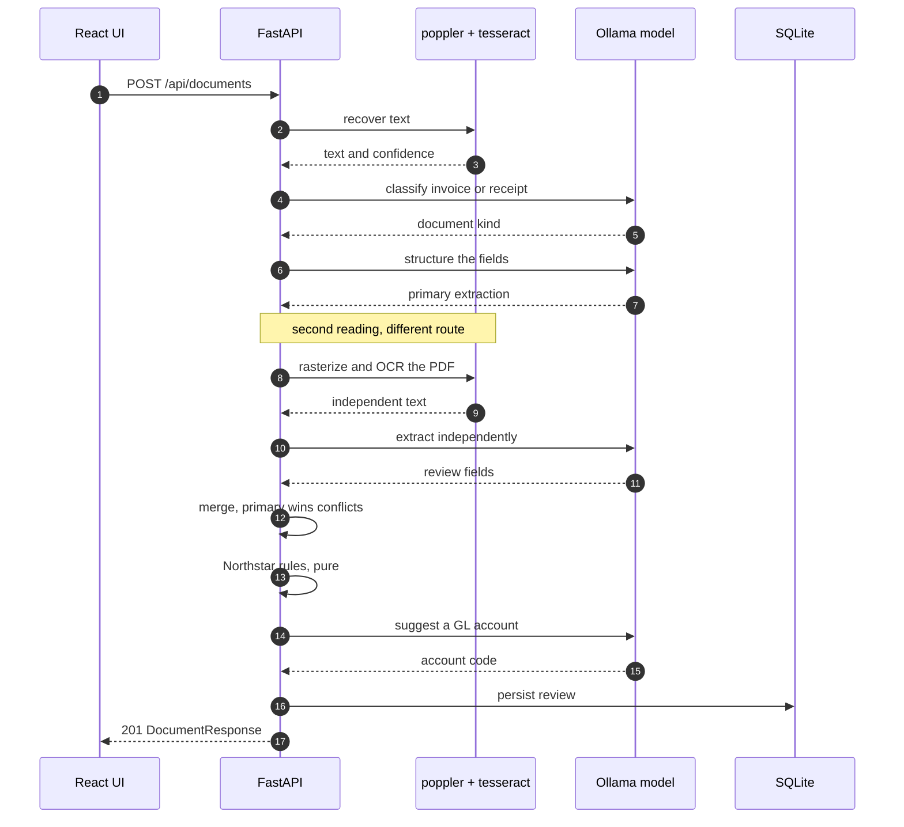

# API endpoints and pipeline

This document describes the Invoice Review HTTP API and how `POST /api/documents` runs the document pipeline.

Base URL (local): `http://localhost:8000`

Interactive docs while the API is running:

- Swagger UI: `http://localhost:8000/docs`
- OpenAPI JSON: `http://localhost:8000/openapi.json`

CORS allows the Vite app at `http://localhost:5173`.

---

## Endpoint summary

| Method | Path | Purpose |
|--------|------|---------|
| `GET` | `/health` | Liveness only: the process is running |
| `GET` | `/ready` | Readiness: OCR binaries and model server usable; 503 when not |
| `GET` | `/api/accounting/gl-accounts` | Fixed Northstar GL catalog |
| `POST` | `/api/documents` | Upload a document and run the full pipeline |
| `GET` | `/api/documents` | List saved reviews (newest first) |
| `GET` | `/api/documents/{document_id}` | Fetch one review |
| `GET` | `/api/documents/{document_id}/file` | Serve the stored upload bytes |
| `PUT` | `/api/documents/{document_id}` | Apply field corrections and revalidate |
| `PUT` | `/api/documents/{document_id}/accounting` | Override / confirm selected GL account |
| `POST` | `/api/documents/{document_id}/decision` | Approve or reject |
| `POST` | `/api/documents/{document_id}/correction-email` | Draft a supplier correction email |
| `DELETE` | `/api/documents/{document_id}` | Delete a saved review and its upload file |

---

## Shared response shape

Document endpoints return `DocumentResponse`:

| Field | Type | Meaning |
|-------|------|---------|
| `id` | string (UUID) | Stable review id |
| `original_filename` | string | Filename from the upload |
| `content_type` | string | `application/pdf`, `image/jpeg`, or `image/png` |
| `status` | string | `processing`, `ready`, `needs_review`, `approved`, `rejected`, or `failed` |
| `classification` | object \| null | Invoice vs receipt label from the local model |
| `extraction` | object \| null | Mapped primary-extraction fields (evidence) |
| `validation` | object \| null | Compact findings summary for the teaching UI |
| `gl_suggestion` | object \| null | Raw pipeline GL suggestion |
| `review_data` | object \| null | Flat editable projection used for policy and Maya edits |
| `document_review` | object \| null | Independent-review comparisons and fallbacks |
| `accounting_coding` | object \| null | Suggestion + selected GL + override flag |
| `issues` | array | Northstar `ValidationIssue` list |
| `supplier_action_required` | bool | True when supplier-fixable issues exist |
| `error_message` | string \| null | Set when status is `failed` |
| `created_at` / `updated_at` | ISO datetime | Persistence timestamps |

Status after a successful pipeline run:

- `needs_review` — validation reported at least one **error**
- `ready` — pipeline finished without validation errors (warnings allowed)

Decided records use `approved` or `rejected` and become immutable. A pipeline exception is persisted as `failed`, then the HTTP handler returns **502**. Unsupported documents from the independent review return **422**.



---

## Pipeline steps

`build_default_pipeline()` runs:

1. **Classification** — the model labels invoice vs receipt from recovered text.
2. **Extraction** — local OCR structured by the `local-invoice` or `local-receipt` extractor.
   PDFs are read through their embedded text layer; images through tesseract.
3. **Document review** — an independent second reading, taken by a *different route* than
   step 2 (a PDF is rasterized and OCRed rather than read through its text layer). The
   result is projected to `ReviewData` and merged into the primary extraction, filling gaps
   only; the primary extraction wins every conflict.
4. **Validation** — pure Northstar invoice/receipt policy plus duplicate detection.
5. **GL categorization** — suggest one catalog code from `6100`–`6190`.

Steps 1, 3 and 5 each make one model call. A correction-email draft adds a fourth, only when
a reviewer requests it.



---

## Review actions

- `PUT /api/documents/{id}` — body is `DocumentCorrectionRequest` (scalar fields only). Changed fields are marked `human` in `field_sources`, then policy re-runs.
- `PUT /api/documents/{id}/accounting` — `{ "gl_account_code": "6170" }` must exist in the catalog.
- `POST /api/documents/{id}/decision` — `{ "decision": "approved" | "rejected" }`. Approval requires no error issues and a valid selected GL.
- `POST /api/documents/{id}/correction-email` — drafts only; the app never sends mail. Requires supplier-fixable issues.

---

## Verification

### Deterministic behaviour

Pure functions decide what a reviewer sees and what blocks approval. They are locked by a
check script that makes no model or network call and runs in about a second:

```bash
cd backend
uv run --locked --no-sync python scripts/check_deterministic.py
```

It covers VAT repair, OCR line reconstruction, confidence scoring, the Northstar rules, and
the independent-reading routes, and exits non-zero on drift.

### Corpus accuracy

```bash
cd backend
uv run --locked --no-sync python scripts/evaluate_corpus.py [options]
```

| Option | Effect |
| --- | --- |
| `--merged` | Score the merged result the application shows, not primary extraction alone |
| `--min-accuracy N` | Exit non-zero below N% field accuracy |
| `--baseline FILE` | Compare against a stored run and fail on regression |
| `--write-baseline` | Record this run instead of comparing |
| `--runs N` | Repeat and report accuracy spread plus documents that changed verdict |
| `--limit N` | Evaluate the first N documents, for fast iteration |

Baselines live in `backend/baselines/` and record the model that produced them; the
evaluator refuses to compare across models, because local and cloud accuracy are not
comparable numbers.

### Per-field error analysis

```bash
uv run --locked --no-sync python scripts/error_analysis.py --report ../docs/evaluation.md
```

Compares every field against the manifest and classifies each disagreement — `missing`,
`spurious`, `truncated`, `neighbour_number`, `wrong_value` — because each implies a different
fix. See [evaluation.md](evaluation.md) for the current findings.

`evaluate_hybrid.py` reports provenance for selected documents: which fields came from the
primary extraction, which the independent review supplied, and which conflicted.

### The two layers catch different things

The corpus evaluator measures end-to-end quality but is insensitive to structural defects a
capable model can compensate for. Reintroducing the OCR line-flattening bug left the corpus
at 169/169 on `gemma4:cloud` while the deterministic checks failed six behaviours
immediately. Neither layer replaces the other.
