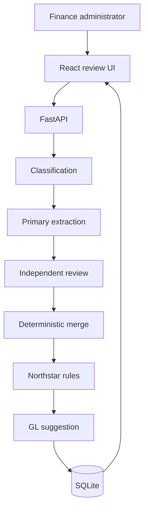

# Architecture

Invoice Review is a small full-stack application. Document extraction runs entirely on the
developer machine through poppler and tesseract. Model calls go through Ollama, which by
default uses a cloud-served model; a local model is supported for offline operation at
measurably lower accuracy.

## Boundaries

- OCR binaries are invoked from one module, `app/services/ocr_text_service.py`.
- Model SDK types stop in the adapters under `app/providers/`.
- Deterministic invoice and receipt rules are pure and live apart from model extraction.
- Routes own HTTP concerns, a service owns orchestration, a repository owns SQLite.
- Environment values are read through one backend settings module and one frontend module.
- A person approves, rejects, or requests a supplier correction after seeing evidence and
  uncertainty.

## Flow

## Reading a document twice, by different routes

A PDF carries an exact embedded text layer and can also be rasterized and read by OCR.
These are two genuinely different readings of the same page, so the application uses one for
each path:

| Path | PDF | Image |
| --- | --- | --- |
| Primary extraction | `pdftotext -layout` | tesseract |
| Independent review | tesseract on the raster | tesseract |

This matters because the review exists to disagree. When both paths read the identical
string, agreement between them carries no information and a shared misreading is confirmed
rather than caught. An image offers only one route, so its review does share a source, and
the returned summary says so rather than implying independence it does not have.

The two routes recover the same content. Measured on `01-en-happy-classic.pdf`, both return
528 non-space characters with every vendor, VAT identifier, invoice number, date and total
present in each.

## Text recovery

`pdftotext -layout` is preferred for PDFs because an accounting system's own text layer is
exact, and it is reported at full confidence. A scan, photo, or image has no text layer and
is rasterized at 200 DPI and passed through tesseract.

Tesseract output is reconstructed into lines using the block, paragraph, and line columns of
its TSV output. On a financial document the line is what binds a label to its amount. A
flattened page puts a fuel grade (`EURO 95`) directly beside the money column, where it is
read as a subtotal.

## Confidence

Confidence is derived rather than model-reported, and expresses **how well the page was
read** — not whether a value was normalized afterwards.

- A value found in the recovered text keeps the document's OCR confidence.
- A value that is not there is reduced by 25%, marking it inferred.
- Required normalization is not an inference. ISO dates are matched against every ordinary
  rendering of the same day, and a VAT identifier repaired from OCR damage is scored against
  the original reading while storing the correction.

## Structured output

Ollama constrains locally-served models with a grammar, so they honour a `json_schema`
response format exactly. Cloud-served models are proxied without that sampler: they ignore
the response format and reply in prose or fenced markdown. `Settings.prompted_output()`
selects the strategy per model, defaulting to prompted for `:cloud` names.

Tool calling, which is pydantic-ai's default output path, is not used — the small local
models this project supports do not implement it.

## Dependency verification

The pipeline depends on two things it does not own: OCR binaries on PATH and a reachable
model server. Neither is verified by importing the application.

- OCR binaries are checked at startup and are fatal when missing, because they cannot appear
  at runtime and every request needs them.
- The model server is reported rather than fatal, because it can legitimately start after
  the application.
- `GET /health` is liveness only. `GET /ready` reports both and returns 503 when a review
  could not actually be served.
