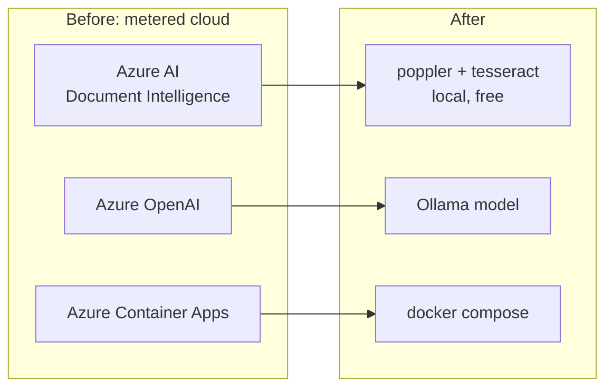

# Build-along guide

The original guided build lives at <https://learn.datalumina.com/docs/invoice-review>.

This repository has since diverged from that tutorial: the Azure services it used have been
replaced with local OCR and Ollama-served models. This guide records those working slices —
what changed, why, the exact commands, and what you should observe.

---

## Slice 1 — Replace the hosted services

**Outcome.** The application no longer calls Azure. Document extraction runs locally through
poppler and tesseract; classification, independent review, GL suggestion, and correction
email go to a model served by Ollama.

**Why.** Every stage that once required a metered cloud account now has a substitute that
runs on the developer machine or through one Ollama subscription.

| Was | Now |
| --- | --- |
| Azure AI Document Intelligence `prebuilt-invoice` / `prebuilt-receipt` | `app/services/ocr_text_service.py` + `app/services/local_extraction_service.py` |
| Azure OpenAI (review, GL, correction email) | Ollama through `app/providers/ollama_client.py` |
| Azure Container Registry / Container Apps | `docker-compose.yml` |



The key seam is that the local extractor emits the same `AnalyzeResult` dictionary shape the
hosted service returned. The invoice and receipt mappers, the domain models, validation, and
the entire frontend were therefore unchanged.

**No Python dependency was added.** The OCR binaries are invoked as subprocesses, so the
dependency policy in `AGENTS.md` held. `azure-ai-documentintelligence` and `azure-identity`
were removed.

```bash
brew install poppler tesseract tesseract-lang   # or apt-get, see docs/local-deploy.md
cd backend && uv sync --locked
cp .env.example .env
```

**Observable result.** `POST /api/documents` returns `201` with a complete review and no
Azure credentials configured anywhere.

**Checkpoint.**
- [ ] `grep -ri azure backend/app` returns nothing.
- [ ] `uv run --locked --no-sync ruff check app scripts` passes.
- [ ] Uploading `samples/generated/01-en-happy-classic.pdf` returns status `ready`.

---

## Slice 2 — Preserve line structure in OCR output

**Outcome.** Tesseract output is reconstructed into lines instead of one flat string.

**Why.** `_parse_tesseract_tsv` joined every word on the page with a space. On a financial
document the *line* is what binds a label to its amount. Flattened, the Dutch fuel receipt
read as:

```
... EURO 95 25.00 L x EUR 2.420 Brandstof EUR 60.50 Subtotaal excl. BTW EUR 50.00 ...
```

The model took `95` (a fuel grade) as the subtotal and `25.00` (a litre count) as VAT.
Tesseract's TSV already reports `block_num`, `par_num`, and `line_num`; all three were being
discarded.

This also explained the accuracy split across the corpus. PDFs go through
`pdftotext -layout`, which preserves structure; both *image* documents went through the
flattening path.

**Observable result.** `11-fr-scan-quality.png` went from failing to 13/13. The fuel
receipt recovered its subtotal, VAT, and full merchant name.

**Checkpoint.**
- [ ] `uv run --locked --no-sync python scripts/check_deterministic.py` passes the `ocr:`
      behaviours.

---

## Slice 3 — Support models that cannot be grammar-constrained

**Outcome.** Structured output works on both locally-served and cloud-served models.

**Why.** Ollama constrains local models with a grammar sampler, so they honour a
`json_schema` response format exactly. Cloud models are proxied without it: they ignore the
schema and reply in prose. `gemma3:1b` therefore needs pydantic-ai's `NativeOutput` and
fails under `PromptedOutput`; `gemma4:cloud` is the exact reverse.

`Settings.prompted_output()` picks per model. `app/providers/structured_output.py`
centralises building the request and parsing a reply that may be fenced or prose-wrapped.

This surfaced a latent defect the grammar sampler had been hiding: the receipt prompt asked
the model to classify the expense, but `ReceiptFields` has no `expense_category` field, only
`receipt_type`. Constrained decoding silently forced compliance; unconstrained, the model
followed the prose and produced a field `extra="forbid"` rejected.

**Observable result.** Both models complete the pipeline.

---

## Slice 4 — Stop penalising confidence for required normalization

**Outcome.** Confidence expresses how well the page was read, not whether the value was
normalized afterwards.

**Why.** Two deliberate, correct transformations were being scored as inferences and pushed
under the 0.80 policy threshold, raising false `low_confidence` warnings:

| Field | Page shows | Stored | Why it was penalised |
| --- | --- | --- | --- |
| `TransactionDate` | `19-07-2026` | `2026-07-19` | ISO conversion the prompt *requires* |
| `CustomerTaxId` | `NLO0449544B01` | `NL00449544B01` | OCR repair the code *deliberately performs* |

A date now matches any ordinary rendering of the same day. A repaired VAT identifier is
scored against the original reading while storing the correction. A value genuinely absent
from the page still takes the penalty, so the signal that matters survives.

`repair_vat_id` also stopped corrupting identifiers it cannot fix — `DE-NOT-A-VAT` was
becoming `DEN0TAVAT`. A rewrite is kept only when it produces a valid VAT number, because an
invalid one is evidence a reviewer may have to quote back to the supplier.

---

## Slice 5 — Verify dependencies instead of failing at first upload

**Outcome.** Missing OCR binaries fail startup; `GET /ready` reports dependency state.

**Why.** `backend/AGENTS.md` requires failing clearly when Ollama is unreachable or an OCR
binary is missing. Neither was checked: `/health` returned `{"status":"ok"}` with tesseract
uninstalled and the model server down, and the failure surfaced only when a reviewer
uploaded their first document.

Binaries are fatal at startup, because they cannot appear at runtime and every request needs
them. The model server is reported rather than fatal, because it can legitimately start
after the application.

```bash
curl -s localhost:8000/health   # liveness only
curl -s localhost:8000/ready    # 503 while OCR or the model server is unusable
```

**Checkpoint.**
- [ ] `/ready` reports `"ready": true` with a working stack.
- [ ] Starting with a bad `TESSERACT_BINARY` raises `MissingDependencyError`.

---

## Slice 6 — Lock the deterministic behaviour

**Outcome.** `scripts/check_deterministic.py` locks 44 behaviours across VAT repair, OCR
line reconstruction, confidence scoring, the Northstar rules, and the independent-reading
routes.

**Why.** These are pure functions that decide what a reviewer sees and what blocks approval,
and they were where the real bugs lived. The script makes no model or network call, runs in
about a second, and exits non-zero on drift.

Per the verification policy this is a check script under `scripts/`, not a pytest suite:
no `tests/` directory, no `*.test.*` files.

```bash
cd backend
uv run --locked --no-sync python scripts/check_deterministic.py
```

**Checkpoint.**
- [ ] The script passes, and reintroducing a known bug makes it fail.

---

## Slice 7 — Make the corpus evaluator able to fail

**Outcome.** The evaluator can gate a build and detect regression.

**Why.** It printed numbers and always exited `0`, and compared only against the manifest,
so it could not detect that results had got *worse*. A prompt change dropped the local model
from 93.5% to 91.7% and was caught only by re-running by hand.

```bash
cd backend
uv run --locked --no-sync python scripts/evaluate_corpus.py --merged
uv run --locked --no-sync python scripts/evaluate_corpus.py --min-accuracy 99
uv run --locked --no-sync python scripts/evaluate_corpus.py --baseline baselines/gemma4-cloud.json
```

`--merged` scores what the application actually shows; without it only primary extraction is
scored, which understates accuracy. `--runs N` reports variance. `--limit N` speeds up
iteration. The duplicate scenario is no longer a blind spot: `is_duplicate` derives from the
manifest scenario.

**Note on coverage.** The corpus evaluator is insensitive to structural defects a capable
model compensates for. Reintroducing the OCR flattening bug left it at 169/169 on
`gemma4:cloud` while the deterministic checks failed six behaviours immediately. The two
layers catch different things.

---

## Slice 8 — Give the independent review a genuinely independent reading

**Outcome.** A PDF is rasterized and OCRed for the review while the primary extraction reads
the embedded text layer.

**Why.** The review re-read the exact text the primary extraction had already read, so
agreement between them carried no information: they could only ever agree, and a shared
misreading would be confirmed rather than caught.

The second route costs no accuracy. Measured on `01-en-happy-classic.pdf`, both routes
recover 528 non-space characters with every vendor, VAT, invoice number, date, and total
present in each. An image has only one route, so its review shares a source and now says so.

---

## Slice 9 — Default to a cloud model

**Outcome.** `DEFAULT_MODEL` is `gemma4:cloud`. Offline operation remains supported through
`OLLAMA_MODEL`.

**Why.** The small local models that fit in ordinary memory are not good enough. Measured on
the 13-document corpus:

| Model | Field accuracy | Exact documents | Policy matches |
| --- | ---: | ---: | ---: |
| `gemma4:cloud` | 100% | 13/13 | 13/13 |
| `gemma3:1b` | 93.5% | 3/13 | 4/13 |

The local model's failures are not cosmetic. It classifies the fuel receipt as an invoice,
which applies the invoice rulebook and raises six errors on a document that should pass, and
it misreads two-column supplier/customer layouts. Larger local models did not fit in
available memory.

Documentation followed the decision: the project no longer claims to be free or offline.
Extraction is local and free; model calls need a signed-in Ollama subscription.

`docker-compose.yml` no longer runs its own Ollama, because cloud credentials belong to the
signed-in host instance and a containerised Ollama cannot authenticate.

```bash
ollama signin
cd backend && cp .env.example .env
./scripts/dev.sh
```

**Checkpoint.**
- [ ] `/ready` reports `"configured": "gemma4:cloud"`.
- [ ] Uploading `13-nl-fuel-receipt.png` classifies it as a **receipt** with zero issues.

---

## Slice 10 — Ask what it is wrong *about*, not just how often

**Outcome.** `scripts/error_analysis.py` compares every field against the manifest and
classifies each disagreement. Results in [evaluation.md](evaluation.md).

**Why.** The corpus evaluator reports that `gemma3:1b` scores 93.5%. That number gave no
guidance about where to spend effort, because it does not say which fields fail or how.

Each failure class implies a different fix, which is the reason for separating them:

| Class | Meaning |
| --- | --- |
| `missing` | Expected a value, extracted nothing. A recall problem. |
| `spurious` | Expected nothing, invented something. |
| `truncated` | Extracted a fragment of the right value. Recognition, not reasoning. |
| `neighbour_number` | Picked a different number **that is printed on the page**. Grounding. |
| `wrong_value` | Complete, plausible, incorrect. Hardest to detect at runtime. |

`neighbour_number` earns its extra code: it separates a model inventing a figure from a
model reading the wrong figure off the document. Lumping both into "wrong" would hide a
grounding failure that has a different fix.

**Observable result.** The eleven errors are four causes, not eleven problems. Five are the
same missing `customer_vat_id` across five documents, because `pdftotext -layout` puts
supplier and customer VAT on one line. Two returned the invoice number as the VAT ID,
matching the country-code prefix rather than the label. Two picked an adjacent amount from
the money column. One returned a field label instead of its value.

That reordered the priorities. Column-aware segmentation removes five errors with a
preprocessing change and no model swap, while three of the remaining errors are already
caught downstream by arithmetic or by `python-stdnum`.

```bash
cd backend
uv run --locked --no-sync python scripts/error_analysis.py --report ../docs/evaluation-gemma4-cloud.md
OLLAMA_MODEL=gemma3:1b uv run --locked --no-sync python scripts/error_analysis.py \
    --report ../docs/evaluation-gemma3-1b.md
```

**Checkpoint.**
- [ ] `gemma4:cloud` reports 169/169 with zero field errors.
- [ ] `gemma3:1b` reports 158/169 and names four distinct failure modes.

---

## Slice 11 — Say it in the first person

**Outcome.** The README opens with the fuel-receipt failure rather than a definition.

**Why.** It read as neutral product documentation: no first-person voice, and the one story
worth telling — a structure fix beating a model swap — was buried in a commit message.
Every claim in it now carries a number that can be checked in the repository, and a "what it
does not do" section states the offline accuracy cost, the absent CI, and that the
confidence threshold is unvalidated.

---

## Full verification

```bash
cd backend
uv run --locked --no-sync ruff check app scripts
uv run --locked --no-sync python scripts/check_deterministic.py
uv run --locked --no-sync python scripts/evaluate_corpus.py --merged \
  --baseline baselines/gemma4-cloud.json --min-accuracy 99
uv run --locked --no-sync python scripts/error_analysis.py

cd ../frontend
pnpm exec tsc -b --pretty false
pnpm lint
pnpm build
```

Then walk the workflow in a browser: upload, review, correct a field, request a correction
email, approve, and delete.

## Known limitations

- Running fully offline with `gemma3:1b` scores 93.5% and misclassifies receipts.
- Nothing runs the gates automatically; there is no CI. A CI runner has no Ollama and no
  subscription, so lint and `check_deterministic.py` are the parts that would work there.
- `evaluate_corpus.py` scores the merged result only with `--merged`; the default understates
  real accuracy.
